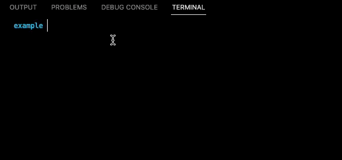
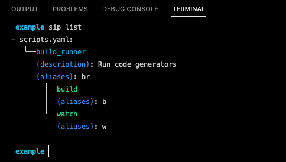

# SIP

Sip is a command-line tool with the goal of making it easier to manage the many commands needed to run a Dart or Flutter project, get dependencies, run tests, and more.



## Features

- Define and run scripts from a `scripts.yaml` file
  - Run scripts concurrently
- Run pub commands, such as `pub get` and `pub upgrade`
  - _recursively and concurrently_
- Run dart/flutter tests
  - _Recursively and concurrently_
  - Pass most all dart/flutter test flags
  - Run only dart or flutter tests

## Installation

```bash
dart pub global activate sip_cli
```

## Usage

```bash
sip --help
```

## Run Scripts

Regardless of your current working directory, the script will always be executed from the same directory as the `scripts.yaml` file.

The `sip run` command will run a script defined within the `scripts.yaml` file.

To view the flags that can be passed to `sip run`, you can run `sip run --help`.

```yaml
build_runner:
    build: dart run build_runner build --delete-conflicting-outputs
```

```bash
$ sip run build_runner build

- dart run build_runner build --delete-conflicting-outputs
...
```

For more information on the `scripts.yaml` file, see the [scripts.yaml configuration](#scriptsyaml-configuration) section.

## Pub Commands

### PUB GET

`sip pub get` runs `pub get` in the closest parent directory containing a `pubspec.yaml` file.

There are flags that can be passed to `sip pub get` that will be passed to `pub get`. The following flags are supported:

- offline
- dry-run
- enforce-lockfile
- precompile

_You can read more about these flags [here](https://dart.dev/tools/pub/cmd/pub-get#options)._

```bash
# Current working directory: packages/core/lib
$ sip pub get

- Running pub get

- (dart)    ./..
```

Sip can determine if flutter is being used within the project, so it will run `flutter pub get` instead of `dart pub get`.

```bash
# Current working directory: packages/ui/lib
$ sip pub get

- Running pub get

- (flutter) ./..
```

### PUB GET (Recursive)

`sip pub get --recursive` runs `pub get` in all children directories containing a `pubspec.yaml` file, **_concurrently_**.

**_Note:_** A pubspec.yaml file does not need to be present in the current working directory.

```bash
# Current working directory: packages
$ sip pub get --recursive

- Running pub get

- (dart)    ./core
- (dart)    ./data
- (flutter) ./ui
- (flutter) ./.
```

### PUB UPGRADE

`sip pub upgrade` runs `pub upgrade`. It performs and functions the same as `sip pub get` but will upgrade all dependencies to the latest version.

There are flags that can be passed to `sip pub upgrade` that will be passed to `pub upgrade`. The following flags are supported:

- offline
- dry-run
- precompile
- tighten
- major-versions

_You can read more about these flags [here](https://dart.dev/tools/pub/cmd/pub-upgrade#options)._

## Running Tests

Sip can run dart/flutter tests, and pass most all dart/flutter test flags. To view all the flags that can be passed to `sip test`, you can run `sip test --help`.

```bash
# Run all tests
$ sip test --recursive --concurrent
```

### --bail

Bailing on tests means that the moment a test fails, the script will stop running, even if there are other tests to run.

By passing the `--bail` flag, the script will stop running after the a test fails. For dart tests, the `--bail` flag will enable the `--fail-fast` flag.

```bash
sip test --bail
```

## `Scripts.yaml` configuration

The `scripts.yaml` file is where you define all the scripts that you would like to run. The `scripts.yaml` file is generally located in the root of your project.

### Defining a script

A script is defined by a key, followed by a colon `:`. The key is the name of the script, and the value is the command to run.

```yaml
# scripts.yaml

build_runner: dart run build_runner build --delete-conflicting-outputs
```

```bash
sip run build_runner # Runs `dart run build_runner build --delete-conflicting-outputs`
```

The value of the script can be a string or a list of strings.

```yaml
# scripts.yaml

build_runner:
    - cd packages/core && dart run build_runner build --delete-conflicting-outputs
    - cd packages/data && dart run build_runner build --delete-conflicting-outputs
```

```bash
$ sip run build_runner

- cd packages/core && dart run build_runner build --delete-conflicting-outputs
...
- cd packages/data && dart run build_runner build --delete-conflicting-outputs
...
```

### Restricted Script Keys

- Allowed characters regex pattern: `^_?([a-z][a-z0-9_.\-]*)?(?<=[a-z0-9_])$`
- Keys that start and end with a parenthesis `(` `)` are reserved for sip.
- Keys must start with a letter or an underscore followed by a letter (optional)
- Keys must end with a letter, number, or underscore

### Nesting scripts

You can nest scripts within other scripts. This helps with reusability and organization.

```yaml
# scripts.yaml

format:
    ui: cd packages/ui && dart format .
    core: cd packages/core && dart format .
```

If you would like to define a script to run **_and_** nest scripts, you can use the `(command)` key to define the command to run.

```yaml
# scripts.yaml

format:
    (command): dart format .
    ui: cd packages/ui && dart format .
    core: cd packages/core && dart format .
```

```bash
sip run format # Runs `dart format .`

sip run format ui # Runs `cd packages/ui && dart format .`
```

### List Commands

You can list all the scripts that are defined within the `scripts.yaml` file.

```bash
sip list # or sip ls
```



You can filter nested scripts by passing in the `--list` flag.


### Referencing other scripts

You can reference other scripts within the `scripts.yaml` file by using the `{$<key>}` symbol. When referencing a script, the command defined for that referenced script will be used.

```yaml
# scripts.yaml

pub_get: dart pub get

pub_get_ui: cd packages/ui && {$pub_get}
```

```bash
$ sip run pub_get

- cd packages/ui && dart pub get
```

Chain references together to access nested scripts.

```yaml
# scripts.yaml

pub:
    (command): dart pub
    get: '{$pub} get'
    ui: cd packages/ui && {$pub:get}
```

```bash
$ sip run pub get ui

- cd packages/ui && dart pub get
```

**_NOTICE:_** The `(command)` key is omitted when referencing a script.

### Flags

By default, all flags passed after the script are ignored.

```yaml
# scripts.yaml

test: dart test
```

```bash
$ sip run test --coverage

- dart test # The --coverage flag is ignored
```

If you would like to tell sip to include a flag _**if it is provided**_ you can use the `{-<flag>}` symbol. Any and all values passed after the flag will be passed to the script.

These flags will remain optional, and can be omitted when running the script.

```yaml
# scripts.yaml

test: dart test {--coverage}

other: other {--flag} {--verbose}
```

```bash
# Supports `=` or spaces
$ sip run test --coverage=coverage

- dart test --coverage=coverage

# Supports multiple values
$ sip run other --flag value1 value2

- other --flag value1 value2

# Supports flags with no values
$ sip run other --verbose

- other --verbose

# Supports multiple flags
$ sip run other --flag value1 value2 --verbose

- other --flag value1 value2 --verbose

# Ignores non-defined flags
$ sip run other --fake

- other
```

### Private keys

Private keys cannot be invoked from the command line, but can be used as references in the `scripts.yaml` file.

To define a private key, prepend the key with the `_` symbol.

```yaml
# scripts.yaml

format:
    _hidden: dart format .
    (command): cd packages/ui && {$format:_hidden}
```

### Bail

Bailing on a script means that the moment a command fails, the script will stop running, even if there are other commands to run.

You can bail a script if you pass the `--bail` flag when running the script.

```bash
$ sip run format --bail

...
✖ Script dart run format failed with exit code unknown: 1

✖ Bailing...
```

Optionally, you can always set a script to fail by using the `(bail):` key in the `scripts.yaml` file.

```yaml
# scripts.yaml

format:
    (bail): # leave blank, or set to: `true`, `yes`, `y`
    (command): dart format
```

```bash
$ sip run format

...
✖ Script dart run format failed with exit code unknown: 1

✖ Bailing...
```

### Run Commands Concurrently

Running scripts concurrently can be useful when you have multiple commands that can be run at the same time. To run commands concurrently, you can run the `sip run` command with the `--concurrent` flag.

```yaml
# scripts.yaml

test:
    - cd packages/ui && dart test
    - cd packages/core && dart test
```

```bash
$ sip run test --concurrent

Running 2 scripts concurrently

- cd packages/ui && dart test
- cd packages/core && dart test
```

Sometimes you may want to single out a group of commands to run concurrently, You can use the concurrent key `(+)` to achieve this.

The commands will be grouped together and run concurrently. Meaning that you can have concurrent and non-concurrent commands mixed together. The commands will always run in the order they are defined.

**Note:**

- The concurrent key _must_ be followed by a space.
- The concurrent key _must_ always be the first characters in the command string.

```yaml
# scripts.yaml

format:
    (command):
        - echo "Running format"
        # ---- start concurrent group
        - (+) cd packages/ui && dart format .
        - (+) cd packages/core && dart format .
        # ---- end concurrent group
        - echo "Finished running format"
```

### Variables

A variable is a placeholder for a value that is to be provided when the script is run. Variables cannot be invoked from the command line, but can be used in the `scripts.yaml` file.

_Variables do not use the `$` symbol._

Sip provides a few variables out of the box that can be used within the `scripts.yaml` file

- `{packageRoot}`: The directory that the pubspec.yaml file is in
- `{scriptsRoot}`: The directory that the scripts.yaml file is in
- `{cwd}`: The current directory that you are in

If you need to create your own variable, you can define them under the `(variables)` key

```yaml
# scripts.yaml
(variables):
    # Check if flutter is installed and that the project is a flutter project
    dartOrFlutter: |-
      if [ -n "$(which flutter)" ] && grep -q flutter pubspec.lock; then
          COMMAND="flutter"
      else
          COMMAND="dart"
      fi

      $COMMAND

deps: cd packages/ui && {dartOrFlutter} pub get
```

```bash
$ sip run deps

- if [ -n "$(which flutter)" ] && grep -q flutter pubspec.lock; then
      COMMAND="flutter"
  else
      COMMAND="dart"
  fi

  $COMMAND pub get
```

^^^ This command will run `flutter pub get` since the `ui` project is a flutter project.

### Example `scripts.yaml` file

```yaml
# scripts.yaml

(variables):
    flutter: fvm flutter

# The name of the script
build_runner:
    # The command to run
    build: dart run build_runner build --delete-conflicting-outputs
    watch:
        # The description of the script
        (description): Run build_runner in watch mode

        # The alternative way to define the command
        (command): dart run build_runner watch --delete-conflicting-outputs

        # The aliases for the script
        (aliases):
            - w

test:
    # {--coverage} is an optional argument, if it is provided, it will be passed into the command, otherwise it will be ignored
    (command): '{flutter} test {--coverage}'

    # {$test} references the defined script `test`. The flag `--coverage=coverage` will activate the coverage flag found in`test`, passing it (--coverage) and it's value (=coverage) to the `test` command
    # Supported flag formats:
    #    e.g. --flag  |  --flag=value  |  --flag value1 value2
    # Supports multiple flags
    #    e.g. --flag1 --flag2=value2 --flag3 value3 value4
    coverage: "{$test} --coverage=coverage"

echo:
    dirs:
        - echo "{packageRoot}" # The directory that the pubspec.yaml file is in
        - echo "{scriptsRoot}" # The directory that the scripts.yaml file is in
        - echo "{cwd}" # The current directory that you are in

format:
    _command: dart format .
    (command):
        - echo "Running format"
        # ---- start concurrent commands
        - (+) {$format:ui} # References the Format UI command
        - (+) {$format:data} # References the Format Data command
        - (+) {$format:application} # References the Format Application command
        # ---- end concurrent commands
        - echo "Finished running format"

    ui: cd packages/ui && {$format:_command}
    data: cd packages/data && {$format:_command}
    application: cd application && {$format:_command}
```
